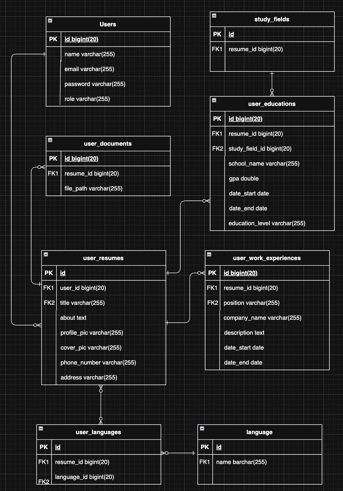

# Resume Management System

This is a web-based platform designed for job seekers and employers. Job seekers can create a profile, upload their resume, and manage their information. Employers can search for talent, view resumes, and contact potential candidates.
<br><br>


***

## 🚀 Project Overview

The Resume Management System allows job seekers to upload their resumes and make them visible to potential employers. Employers can browse through the available talent, view detailed profiles, and download resumes. The system is designed to be a seamless interface for both job seekers and employers.

***

## ✨ Features

### 👤 For Job Seekers
- 🔐 **Account Management**: Register, log in, reset password via email verification.
- 📝 **Profile Creation**: Add personal details, bio, work experience, and education.
- 📎 **Resume Upload**: Upload, preview, and display your resume on your profile.
- 🖼️ **Profile Customization**: Update profile photo and cover image.
- ❌ **Account Deletion**: Safe account deletion with confirmation prompt.

### 🧑‍💼 For Employers
- 🔐 **Account Management**: Register and log in securely.
- 🔍 **Talent Search**: Filter candidates by:
  - Username
  - Study Field
  - Language
  - Minimum Work Experience
- 🧾 **Candidate Profiles**: View complete candidate details.
- 📥 **Resume Access**: Preview and download resumes.
- ❓ **FAQ Page**: Searchable FAQs to address common questions.
- 🧑‍💻 **Profile Management**: Edit employer profile, work history, and education.

***

## 🛠️ Technologies & Tools

| Layer     | Technologies                     |
|-----------|----------------------------------|
| Frontend  | HTML, CSS, JavaScript, Bootstrap |
| Backend   | PHP (Laravel Framework)          |
| Database  | MySQL                            |
| Server    | Laragon                          |

***

## ⚙️ Setup and Installation

To set up the project locally, please follow these steps:

**Prerequisites:**
1.  Download and install Laragon.
2.  Ensure you have the latest version of PHP and Composer.

**Installation Steps (to be run in the Laragon terminal):**

1.  **Unzip Project**: Unzip the `ProjectGroup8Misty.zip` file.
2.  **Install PHP Dependencies**:
    ```bash
    composer install
    ```
   
3.  **Create Environment File**:
    ```bash
    cp .env.example .env
    ```
   
4.  **Configure Environment**:
    * **Set up your SMTP** in the `.env` file for email functionalities.
    * **Generate a new App Key**:
        ```bash
        php artisan key:generate
        ```
       
5.  **Run Database Migrations and Seed**:
    ```bash
    php artisan migrate:fresh --seed
    ```
   
6.  **Install Frontend Dependencies**:
    ```bash
    npm install
    ```
   
    Then, build the assets:
    ```bash
    npm run build
    ```
   
7.  **Run the Server**:
    ```bash
    php artisan serve
    ```

***

## 🗃️ Database Design

The database schema includes the following tables:
* `Users`
* `user_resumes`
* `user_documents`
* `user_work_experiences`
* `user_educations`
* `study_fields`
* `user_languages`
* `language`

Here is the Entity-Relationship Diagram:



***

## 👥 Contributors

| Contributor | GitHub Profile |
|-------------|----------------|
|  <br> **TAN ZHENG YU** | [@zhengyu89](https://github.com/zhengyu89) |
|  <br> **TAN ZHEN LI** | [@ZhenLi0413](https://github.com/ZhenLi0413) |
|  <br> **BENJAMIN CHEW** | [@Benjamin8763](https://github.com/Benjamin8763) |
|  <br> **TEOW ZI XIAN** | [@zx823](https://github.com/zx823) |

---

## 📄 License

This project is licensed under the **MIT License**.  
See the [LICENSE](LICENSE) file for more details.

---
